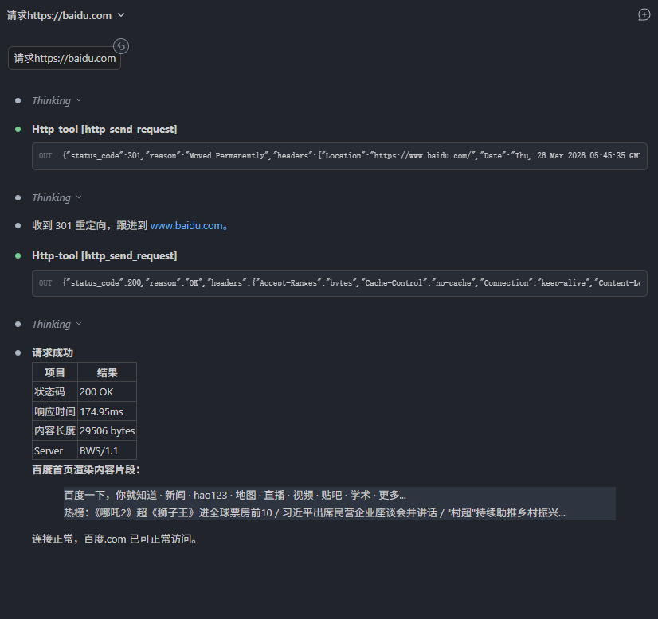
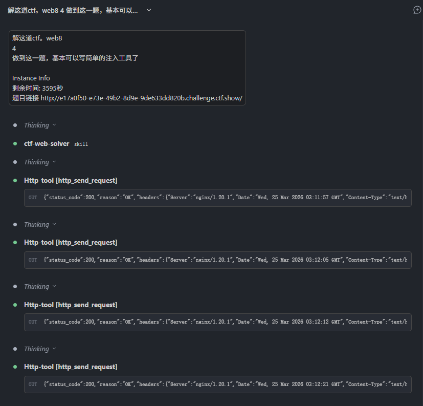

# HTTP MCP - HTTP 请求工具

发送 HTTP/1.1 请求的 MCP 工具，带有安全控制。

基于 FastMCP 构建。

适用于Web渗透测试、调试。

[README_EN](README_EN.md)

## 功能特性

- 支持 HTTP/1.1 协议（暂不支持HTTP/2）
- 支持原始 HTTP 请求报文解析
- 安全控制：
  - 域名白名单/黑名单
  - 私有 IP 访问控制
  - 请求/响应大小限制
  - SSL 证书验证控制
  - HTTP 方法限制
- HTTP 代理支持
- HTML 标签自动去除（缩短上下文，默认开启）
- 自定义 Host 头和 Content-Length

## MCP 工具

### http_send_request

发送原始 HTTP 请求报文。

**参数：**

| 参数 | 类型 | 默认值 | 说明 |
|------|------|--------|------|
| `content` | string | 必需 | 原始 HTTP 请求报文|
| `baseurl` | string | 必需 | 完整 URL，如 `https://example.com` |
| `timeout` | number | 30 | 超时时间（秒） |
| `strip_html` | boolean | true | 去除响应中的 HTML 标签 |
| `allow_custom_host` | boolean | false | 允许自定义 Host 头 |
| `allow_custom_content_length` | boolean | false | 允许自定义 Content-Length |
| `files` | array | - | ⚠️ 推荐使用：文件上传，自动构建正确的 multipart/form-data 格式 |

**原始请求报文格式：**
```
POST /api/users HTTP/1.1
Host: example.com
Content-Type: application/json
User-Agent: Mozilla/5.0

{"name": "test", "value": 123}
```


**使用示例：**

```python
# 1. 简单请求
http_send_request(
    content="GET / HTTP/1.1\r\nHost: example.com\r\n\r\n",
    baseurl="https://example.com"
)

# 2. 指定目标服务器
http_send_request(
    content="GET /api HTTP/1.1\r\nHost: example.com\r\n\r\n",
    baseurl="https://api.server.com"
)

# 3. 自定义 Host 头（用于测试 CDN 或虚拟主机）
http_send_request(
    content="GET / HTTP/1.1\r\nHost: custom-host.com\r\n\r\n",
    baseurl="https://example.com",
    allow_custom_host=True
)

# 4. 保留 HTML 标签
http_send_request(
    content="GET /page HTTP/1.1\r\nHost: example.com\r\n\r\n",
    baseurl="https://example.com",
    strip_html=False
)

# 5. 文件上传（multipart/form-data）
# 注意：content 只需要基本的请求行和 Host，不需要包含 multipart 内容
http_send_request(
    content="POST /upload HTTP/1.1\r\nHost: example.com\r\n\r\n",
    baseurl="https://example.com",
    files=[
        {"name": "file", "filename": "test.txt", "content": "hello world", "content_type": "text/plain"},
        {"name": "submit", "content": "upload"}  # 普通字段不需要 filename
    ]
)
```

**注意：** 当使用 `allow_custom_host=True` 时：
- `baseurl` 指定实际连接的服务器
- HTTP 请求头中的 `Host` 使用原始请求中的值
- 如果目标服务器不认识自定义的 Host 头，会返回错误

### http_build_request

从方法、URL、头部和请求体构建原始 HTTP 请求报文。

**参数：**
- `method` (必需): HTTP 方法
- `url` (必需): 完整 URL
- `headers`: 请求头对象
- `body`: 请求体

## 安全提示

⚠️ **默认配置风险说明**：
- `allow_private_ips: true`：默认允许访问内网IP地址，在不可信环境中使用存在SSRF攻击风险，生产环境建议设置为`false`
- `verify_ssl: false`：默认不验证SSL证书，存在中间人攻击风险，生产环境建议设置为`true`
- `follow_redirects: false`：默认不自动跟随重定向，需要时可手动开启
- `http_proxy: ""`：默认不使用代理

代理优先级：环境变量 `HTTP_PROXY`/`HTTPS_PROXY` > `config.json` 中的配置

## 配置

### config.json

```json
{
  "security": {
    "allowed_domains": ["*"],
    "blocked_domains": [],
    "allow_private_ips": true,
    "allow_http": true,
    "max_request_size": 10485760,
    "max_response_size": 52428800,
    "timeout": 30,
    "verify_ssl": false,
    "allowed_methods": ["GET", "POST", "PUT", "DELETE", "PATCH", "HEAD", "OPTIONS"]
  },
  "http": {
    "follow_redirects": false,
    "http_proxy": ""
  }
}
```

### HTTP 代理配置

通过以下方式配置代理：
1. 修改 `config.json` 中的 `http.http_proxy`
2. 设置环境变量 `HTTP_PROXY` 或 `http_proxy`（优先级更高）

### 环境变量

- `HTTP_PROXY` / `http_proxy`: HTTP 代理地址
- `HTTPS_PROXY` / `https_proxy`: HTTPS 代理地址

## 依赖安装

```bash
pip install -r requirements.txt
```

依赖列表：
- fastmcp >= 0.1.0
- hackrequests >= 0.2.0
- beautifulsoup4 >= 4.12.0

## 测试

```bash
# 在项目根目录执行
PYTHONPATH=. python3 http_mcp/test_mcp.py
```

## MCP 配置

添加到你的 `.mcp.json` 配置文件中，注意替换`<你的项目根目录路径>`为实际的代码存放路径：

```json
{
  "mcpServers": {
    "http-tool": {
      "command": "python3",
      "args": ["<你的项目根目录路径>/http_mcp/run_server.py"]
    }
  }
}
```

又或者使用uv：
```json
{
  "mcpServers": {
    "http-tool": {
      "command": "uv",
      "args": ["run", "python3", "<你的项目根目录路径>/http_mcp/run_server.py"]
    }
  }
}
```

## 测试
| 测试项                       | 状态   |
| ---------------------------- | ------ |
| GET 请求                     | ✅ 正常 |
| POST JSON                    | ✅ 正常 |
| POST form-urlencoded         | ✅ 正常 |
| 自定义 Header                | ✅ 正常 |
| 状态码 200/404/500           | ✅ 正常 |
| 延迟响应 (delay/N)           | ✅ 正常 |
| PUT/PATCH/DELETE             | ✅ 正常 |
| OPTIONS 请求                 | ✅ 正常 |
| Query String 参数            | ✅ 正常 |
| 重定向响应 (不跟随)          | ✅ 正常 |
| 空 Body POST                 | ✅ 正常 |
| UTF-8 中文字符               | ✅ 正常 |
| HTTP-MCP/1.0 默认 User-Agent | ✅ 正常 |

MiniMax-M2.5/2.7、doubao-seed-2.0-pro、Kimi k2.5等主流大模型经测试均可正确调用✅。

**已知Bug（但暂不打算修复）**
🐛 Bug #1: 空 Header 值报错 （HackRequests.py原生bug）
🐛 Bug #2: Chunked Transfer-Encoding 不支持


## 食用方法


## 效果演示



## 安全最佳实践
1. 生产环境务必修改默认安全配置：
   - 设置 `allow_private_ips: false` 阻止内网访问
   - 设置 `verify_ssl: true` 开启SSL证书验证
2. 限制 `allowed_domains` 为实际需要访问的域名范围
3. 不要在公共环境中暴露MCP服务端口
4. 定期更新依赖包修复安全漏洞

## License
MIT
